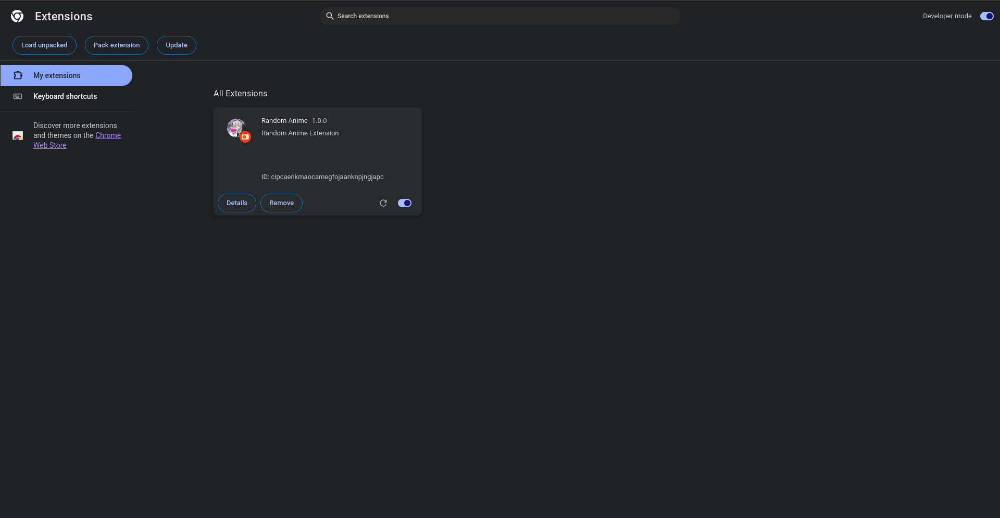

# Random Anime Extension

Random Anime Extension is a browser extension which will help you discovering new and exciting anime with just a click. Perfect for anime enthusiasts and those looking to dive into the world of anime, our extension offers a simple yet delightful experience.

## Features

- **Random Anime Suggestions**: Every time you click on the app logo, get a new, randomly selected anime suggestion. It's a great way to discover shows you might never have considered watching.
- **Easy Access**: No need to navigate through websites or apps. A simple click on your browser gives you a fresh suggestion.
- **Lightweight and Fast**: Designed to be unobtrusive, the extension is lightweight and quick, ensuring your browsing experience remains smooth.

## Installation

1. Clone this repo `https://github.com/imanav10/anime.git`.
2. Open Chrome or firefox enable developers option and load unpacked.
3. Go to `anime/dist` and unpack that folder.
4. Enable the extension and enjoy.

## How It Works

After installation, simply click on the Random Anime logo in your browser's extension area. The extension will then present you with the name and a brief description of a randomly selected anime. It's that easy!

## Support

If you encounter any issues or have suggestions for improvement, please feel free to open an issue on our GitHub repository: [Random Anime Issues](https://github.com/imanav10/anime/issues).

## Contributing

Contributions are welocmed, If you're interested in improving the Random Anime Extension, please submit your pull request.

Thank you for trying out the Random Anime Extension. Happy anime discovering!
